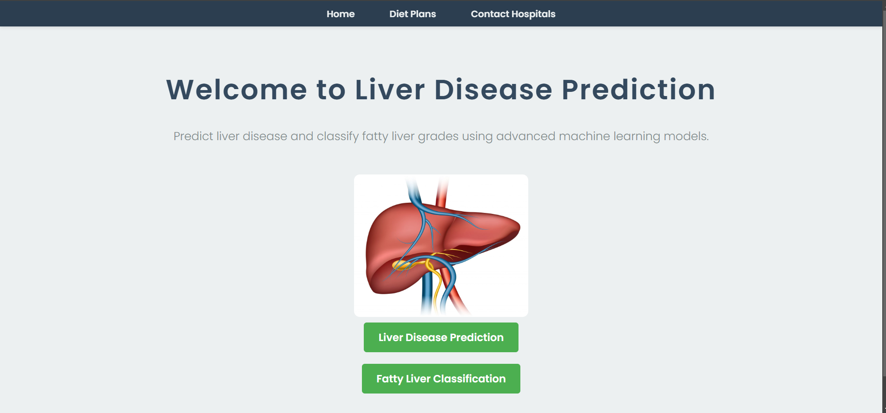
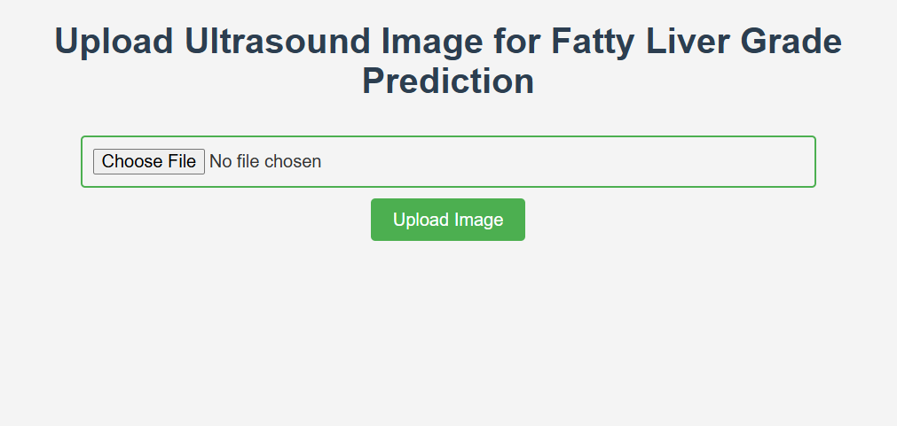
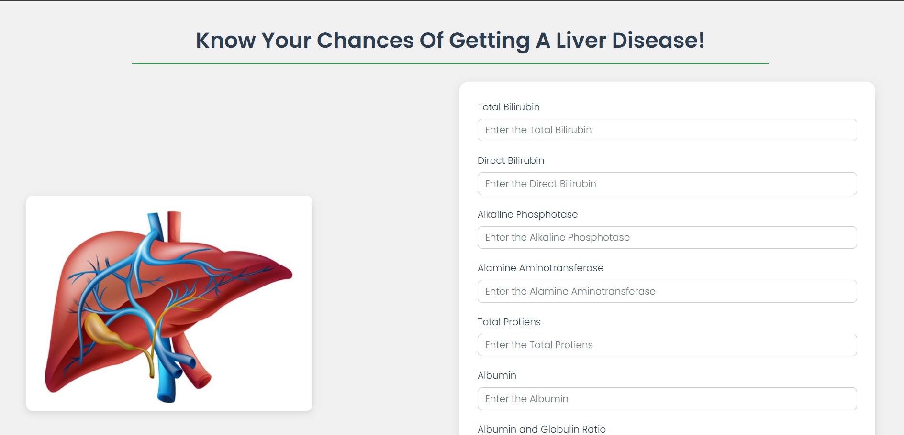

This project is a comprehensive solution for liver health analysis. It integrates two machine learning models:

Liver Disease Prediction: Predicts the presence of liver disease based on patient blood test data.
Fatty Liver Grade Classification: Classifies liver ultrasound images into different fatty liver grades (Normal, Grade 1, Grade 2, Grade 3).
The models are deployed using Flask and combined into a full-fledged dynamic website. This platform enables users to assess their liver health in a user-friendly and efficient manner.

Tech Stack
Backend: Flask (Python)
Frontend: HTML, CSS, JavaScript
Machine Learning Models:
Random Forest for Liver Disease Prediction
Deep Learning Model for Fatty Liver Classification

# Liver Disease Prediction

## Homepage

## Features Page

## Contact Page

